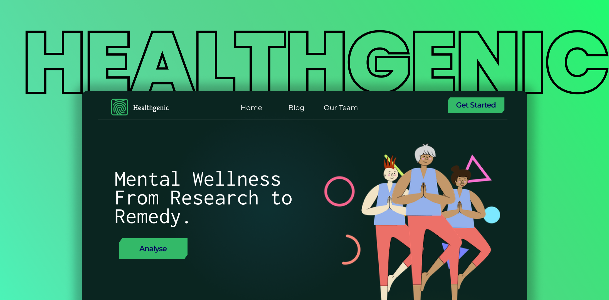

# Healthgenic

<h1 align="center">Healthgenic</h1>

# Tech Stack

- React
- MongoDB
- NodeJs 
- ExpressJs

## Inspiration

We think that participating in this hackathon will greatly advance our careers. Furthermore, we would love to create some excellent UI designs for this health theme because it is interesting. It's an excellent opportunity to study, advance our knowledge, sharpen our talents, and choose the best strategy for the project's success.

## What it does

Tells us about the appropiate nutrition, calories needed for your body.

## How we built it

We started off by planning and customizing the UI design and what major things to include. Then we proceeded to build the backend, deal with database then tested and finalized. To make this project, we used many tech stacks and APIs. Some of them include - React, NodeJS, ExpressJS, Auth0, MongoDB, GraphQL, Mongoose, etc.

## Challenges we ran into

We faced some issues while dealing with git version control when we tried pushing multiple commits but later we could figure that out.

## Accomplishments that we're proud of

We could successfully implement new features we learnt for this hackathon and could test out successfully.

## What we learned

We learned about some APIs. Most importantly, this hackathon taught us how to work and contribute together and accomplish more together, some troubleshooting methodologies and engaging with different tech stacks.

## What's next for Healthgenic

We are planning to implement system through which an indivisual can fill in a survey and get recommandations according to his/her current health status.

## Contributors

- [Barat Nikhita](https://github.com/nikhitaBarat/)
- [Siddhant Prateek](https://github.com/siddhantprateek)
- [Shahana Shamim](https://github.com/S-170802)
